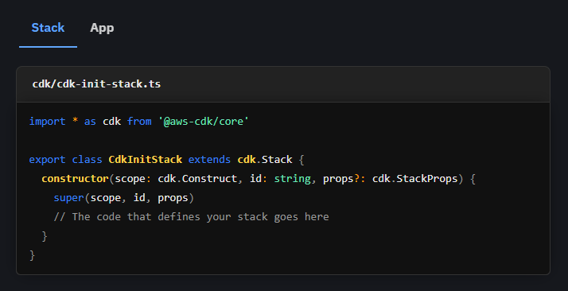

# rehype-tabular-code

[**rehype**][rehype] plugin to merge stacked codeblocks into one, tabbed instance.



## Install

This package is [ESM only](https://gist.github.com/sindresorhus/a39789f98801d908bbc7ff3ecc99d99c):
Node 12+ is needed to use it and it must be `import`ed instead of `require`d.

[npm][]:

```sh
npm install --dev rehype-tabular-code
```

[yarn][]:

```sh
yarn add -D rehype-tabular-code
```

## Use

With the following markdown, in a file called `codeblocks.md`:

````
```typescript tab="Example 1"
const doesPinappleGoOnPizza = false;
```

```ts tab="Example 2"
const foo = "bar";
```
````

and this pipeline in a file called `example.js`:

```ts
import fs from 'fs'
import { unified } from 'unified'
import remarkParse from 'remark-parse'
import remarkRehype from 'remark-rehype'
import rehypeTabularCode from 'rehype-tabular-code'
import rehypeStringify from 'rehype-stringify'

const mdbuf = fs.readFileSync('codeblocks.md')(async function main() {
  const html = await unified()
    .use(remarkParse)
    .use(remarkRehype)
    .use(rehypeTabularCode, {
      tagNames: {
        contentContainer: 'section',
      },
      classNames: {
        tab: 'code-tab',
      },
    })
    .use(rehypeStringify)
    .process(mdbuf)
  console.log(html)
})()
```

Running `node example.js` yields:

```html
<div class="tabular-code">
  <ul class="tabular-code-tabs">
    <li class="code-tab active-tab">Example 1</li>
    <li class="code-tab">Example 2</li>
  </ul>

  <section class="tabular-code-content">
    <div>
      <pre><code class="language-ts"> ... code content ... </code></pre>
    </div>
    <div class="hidden">
      <pre><code class="language-ts"> ... code content ... </code></pre>
    </div>
  </section>
</div>
```

## API

This package exports no identifiers.
The default export is `rehypeTabularCode`.

### `unified().use(rehypeTabularCode[, options])`

Merge already parsed and stacked codeblocks into one tabbed container.

##### `options`

###### `options.classNames`

This option can be used in order override the default classnames set by the plugin.

```ts
/** Used to modify the classname of each part of the tabular codeblock */
classNames: {
  /** The classname(s) used for the wrapping container that wraps all tabs and content
   * @default "tabular-code"
   */
  container?: string | string[]
  /** The classname(s) used for the wrapping container that wraps all tabs
   * @default "tabular-code-tabs"
   */
  tabContainer?: string | string[]
  /** The classname(s) used for the element containing the tab title
   * @default "tabular-code-tab"
   */
  tab?: string | string[]
  /** The classname(s) used for the element containing the FIRST tab title
   * @default "active-tab"
   */
  activeTab?: string
  /** The classname(s) used for the container that wraps all content
   * @default "tabular-code-content"
   */
  contentContainer?: string | string[]
  /** The classname(s) used for the element that wraps each codeblock
   * @default undefined
   */
  content?: string | string[]
}
```

###### `options.tagNames`

This option can be used in order override the default tagnames set by the plugin.

```ts
/** Used to define the HTML elements to be used by each part of the tabular codeblock */
tagNames: {
  /** The tagname used for the wrapping container that wraps all tabs and content
   * @default "div"
   */
  container?: string
  /** The tagname used for the wrapping container that wraps all tabs
   * @default "ul"
   */
  tabContainer?: string
  /** The tagname used for the element containing the tab title
   * @default "li"
   */
  tab?: string
  /** The tagname used for the container that wraps all content
   * @default "div"
   */
  contentContainer?: string
  /** The tagname used for the element that wraps each codeblock
   * @default "div"
   */
  content?: string
}
```

## Security

Use of `rehype-tabular-code` can open you up to a
[cross-site scripting (XSS)][xss] attack if you pass user provided content in
`properties` or `content`.

Always be wary of user input and use [`rehype-sanitize`][sanitize].

## Related

- [`rehype-code-titles`][titles]
  — Add `id`s to headings
- [`rehype-highlight`](prism)
  — Syntax highlight code blocks

## Contribute

See [`contributing.md`][contributing] in [`rehypejs/.github`][health] for ways
to get started.
See [`support.md`][support] for ways to get help.

This project has a [code of conduct][coc].
By interacting with this repository, organization, or community you agree to
abide by its terms.

## License

[MIT][license] © [Malte Hallström][author]

<!-- Definitions -->

[downloads-badge]: https://img.shields.io/npm/dm/rehype-tabular-code.svg
[downloads]: https://www.npmjs.com/package/rehype-tabular-code
[size-badge]: https://img.shields.io/bundlephobia/minzip/rehype-tabular-code.svg
[size]: https://bundlephobia.com/result?p=rehype-tabular-code
[npm]: https://docs.npmjs.com/cli/install
[yarn]: https://classic.yarnpkg.com/lang/en/docs/install
[health]: https://github.com/rehypejs/.github
[contributing]: https://github.com/rehypejs/.github/blob/HEAD/contributing.md
[support]: https://github.com/rehypejs/.github/blob/HEAD/support.md
[license]: license
[author]: https://hallstrom.dev
[rehype]: https://github.com/rehypejs/rehype
[xss]: https://en.wikipedia.org/wiki/Cross-site_scripting
[sanitize]: https://github.com/rehypejs/rehype-sanitize
[titles]: https://github.com/rockchalkwushock/rehype-code-titles
[prism]: https://github.com/timlrx/rehype-prism-plus
